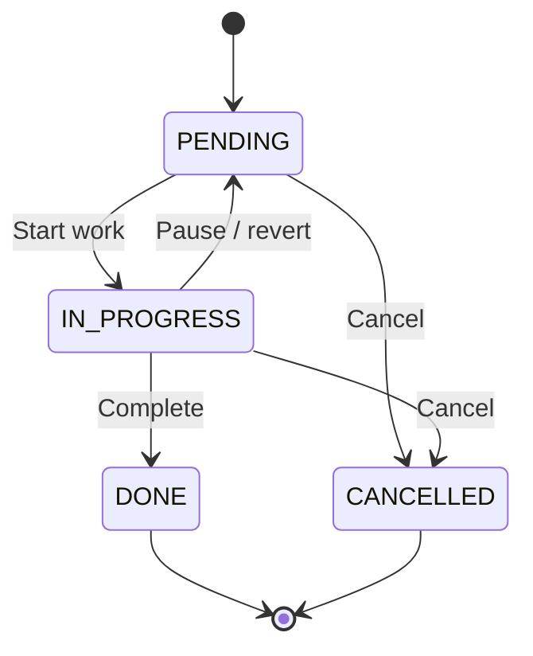

# Task Management System

This is a **Task Management System** built with Spring Boot and Drools, designed to manage tasks and enforce valid state transitions using business rules. The system allows users to create, update, and transition tasks between states (e.g., `PENDING`, `IN_PROGRESS`, `DONE`, `CANCELLED`) while ensuring invalid transitions are caught and handled appropriately.

## Features
- Create and manage tasks with attributes like `title`, `description`, `status`, `newStatus`, `priority`, `dueDate`, `createdAt`, and `updatedAt`.
- Rule-based task state transitions using Drools 8.44 to enforce valid transitions (e.g., `PENDING` to `IN_PROGRESS`) and prevent invalid ones (e.g., `DONE` to `PENDING`).
- Logging with SLF4J and Logback for debugging and monitoring rule execution.
- Spring Boot for dependency injection and application configuration.

## Technologies
- **Java**: 17 or later
- **Spring Boot**: 2.7.18
- **Drools**: 8.44.0.Final
- **SLF4J/Logback**: For logging
- **Maven**: Build tool
- **JUnit**: For testing
- **Docker**:To run db
- **pgsql**:15

## Prerequisites
- Java 17 or later
- Maven 3.6+
- Git

## Setup Instructions

1. **Clone the Repository**
   ```bash
   git clone https://github.com/ShashankC10/task-management.git
   cd task-management
   ```
2. **Install Dependencies**
   Ensure you have Maven installed, then run
    ```bash
   mvn spring-boot:run
   ```
## Project Structure
task-management/
├── src/
│   ├── main/
│   │   ├── java/org/example/task_management/
│   │   │   ├── config/
│   │   │   │   └── DroolsConfig.java       # Configures Drools KieContainer and KieSession
│   │   │   ├── model/
│   │   │   │   ├── db/
│   │   │   │   │   └── Task.java           # Task entity
│   │   │   │   ├── Status.java             # Status enum (PENDING, IN_PROGRESS, DONE, CANCELLED)
│   │   │   │   └── exception/
│   │   │   │       └── InvalidTaskTransitionException.java  # Custom exception for invalid transitions
│   │   │   └── service/
│   │   │       └── RulesService.java       # Service to fire Drools rules
│   │   └── resources/
│   │       ├── rules/
│   │       │   └── task_rules.drl          # Drools rules for task transitions
│   │       ├── META-INF/
│   │       │   └── kmodule.xml             # Drools configuration
│   │       ├── application.properties       # Spring Boot configuration
│   │       └── logback.xml                 # Logging configuration
│   └── test/
│       └── java/org/example/task_management/
│           └── RulesServiceTest.java       # Tests for RulesService
├── pom.xml                                    # Maven dependencies
└── README.md                                  # This file

## 🔀 State Transition Allowed in the state machine



## Contact
For issues or questions, contact ShashankC10 or open an issue on GitHub.

