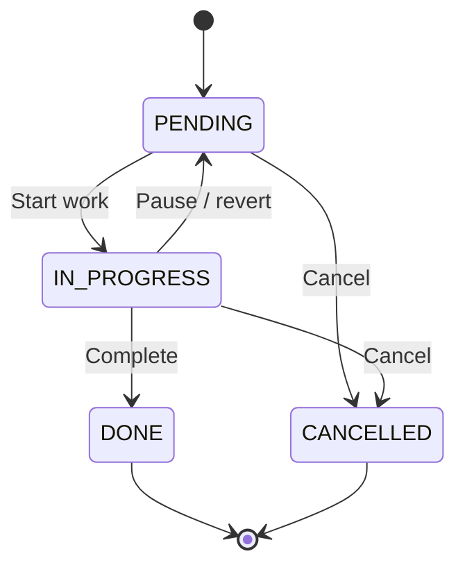

# Task Management System

This is a **Task Management System** built with Spring Boot and Drools, designed to manage tasks and enforce valid state transitions using business rules. The system allows users to create, update, and transition tasks between states (e.g., `PENDING`, `IN_PROGRESS`, `DONE`, `CANCELLED`) while ensuring invalid transitions are caught and handled appropriately.

## Features
- Create and manage tasks with attributes like `title`, `description`, `status`, `newStatus`, `priority`, `dueDate`, `createdAt`, and `updatedAt`.
- Rule-based task state transitions using Drools 8.44 to enforce valid transitions (e.g., `PENDING` to `IN_PROGRESS`) and prevent invalid ones (e.g., `DONE` to `PENDING`).
- Logging with SLF4J and Logback for debugging and monitoring rule execution.
- Spring Boot for dependency injection and application configuration.

## Technologies
- **Java**: 24
- **Spring Boot**: 3.5.5
- **Drools**: 8.44.0.Final
- **SLF4J/Logback**: For logging
- **Maven**: Build tool
- **JUnit**: For testing
- **Docker**: To run the stack (service + Postgres + Kafka + OpenSearch)
- **PostgreSQL**: 15

## Prerequisites
- Java 24
- Maven 3.6+
- Git

## Setup Instructions

1. **Clone the Repository**
   ```bash
   git clone https://github.com/ShashankC10/task-management.git
   cd task-management
   ```
2. **Install Dependencies**
   Ensure you have Maven installed, then run
    ```bash
   mvn spring-boot:run
   ```

## API Documentation
- Swagger UI (live docs): http://localhost:8080/swagger-ui/index.html
- OpenAPI spec: http://localhost:8080/openapi.yaml (also in `src/main/resources/static/openapi.yaml`)
- Run the full stack in Docker (app + Postgres + Kafka + OpenSearch): `docker compose -f docker-compose-platform.yml up -d && docker compose up -d` then hit the Swagger UI.
## Project Structure
```declarative
task-management/
├── src/
│   ├── main/
│   │   ├── java/
│   │   │   └── org/example/task_management/
│   │   │       ├── config/              -> Spring + Drools configuration
│   │   │       │   └── DroolsConfig.java
│   │   │       ├── controller/          -> REST controllers
│   │   │       │   └── CreateTaskController.java
│   │   │       ├── model/               -> Domain models
│   │   │       │   ├── db/              -> Entity classes
│   │   │       │   │   └── Task.java
│   │   │       │   ├── Status.java      -> Enum for task states
│   │   │       │   └── exception/       -> Custom exceptions
│   │   │       │       └── InvalidTaskTransitionException.java
│   │   │       ├── service/             -> Business logic layer
│   │   │       │   └── TaskService.java
│   │   │       └── TaskServiceApplication.java  -> Spring Boot entrypoint
│   │   └── resources/
│   │       ├── application.yml          -> Spring Boot configuration
│   │       ├── META-INF/
│   │       │   └── kmodule.xml          -> Drools knowledge module config
│   │       ├── rules/
│   │       │   └── task_state_transition.drl   -> Drools rules
│   │       └── static/openapi.yaml       -> OpenAPI 3 specification
│   └── test/                            -> Unit & integration tests
│       └── java/
│           └── org/example/task_management/
│               └── ... (test classes)
├── .gitignore
├── pom.xml                              -> Maven dependencies & build config
├── README.md                            -> Project documentation
└── PROJECT_STRUCTURE.txt                -> Project structure (this file)
```

## State Transition Allowed in the state machine


```mermaid
stateDiagram-v2
    [*] --> PENDING

    PENDING --> IN_PROGRESS : Start work
    PENDING --> CANCELLED   : Cancel

    IN_PROGRESS --> DONE     : Complete
    IN_PROGRESS --> PENDING  : Pause / revert
    IN_PROGRESS --> CANCELLED: Cancel

    DONE --> [*]
    CANCELLED --> [*]
```

## Contact
For issues or questions, contact ShashankC10 or open an issue on GitHub.
